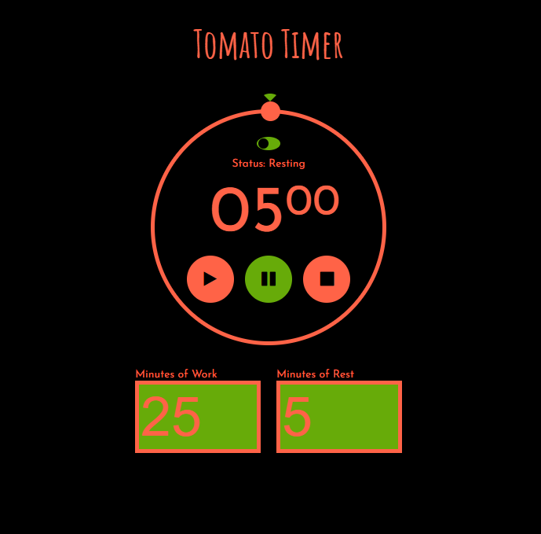

# Pomodoro Timer

#### Technologies used: HTML, CSS, and JavaScript

This application uses the aforementioned technologies to create a timer with intervals to designate work and break periods.

* link to deployed application: https://fbuonojr.github.io/tomato-timer/

###### Frank Buono- this app was created as practice using an activity from my bootcamp class